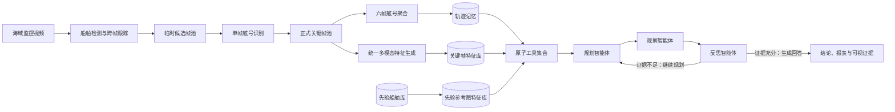

<div align="center">

# 🌊 SeaAgent

### 面向海域船舶监控的轨迹中心分层记忆闭环多智能体系统

<p>
  
  
  
  
  
</p>

<p>
  <a href="#-系统概览">系统概览</a> ·
  <a href="#-核心能力">核心能力</a> ·
  <a href="#-快速开始">快速开始</a> ·
  <a href="#-项目结构">项目结构</a> ·
  <a href="#-配置说明">配置说明</a>
</p>

</div>

> SeaAgent 面向海域船舶监控场景，以单段监控视频为处理对象，将船舶检测、跨帧跟踪、关键帧筛选、舷号聚合、统一多模态特征检索与闭环问答整合为一条可追溯、可核验的完整链路。

---

## 🧭 系统概览

传统视频问答通常直接对原始帧进行推理，容易受到长视频冗余、目标重复出现、舷号模糊和证据不可追溯等问题影响。SeaAgent 将视频首先转换为以船舶轨迹为中心的分层记忆，再由规划、观察和反思三个智能体围绕记忆执行工具调用与证据核验。



### 处理主链

```text
监控视频
  → YOLO 检测与 ByteTrack 跟踪
  → 每十帧生成候选船舶裁剪图
  → 临时池质量预筛与异步单帧识别
  → 正式关键帧池，每条轨迹最多保留六帧
  → 舷号类别与可读性置信度联合聚合
  → Qwen3-VL-Embedding-2B 生成 2048 维归一化特征
  → 轨迹记忆、关键帧特征库与先验参考图特征库
  → 规划—观察—反思闭环问答
```

---

## ✨ 核心能力

| 能力 | 设计 | 作用 |
|---|---|---|
| **轨迹中心记忆** | 以一次连续出现的船舶轨迹作为基本记录单元 | 避免逐帧问答造成的信息重复与目标混淆 |
| **双池关键帧机制** | 临时池负责预筛，正式池保存最多六张有效证据帧 | 兼顾帧质量、时间覆盖与舷号可读性 |
| **轨迹级舷号聚合** | 将可读舷号与无可读舷号共同作为聚合类别 | 降低单帧误识别对最终结果的影响 |
| **统一多模态特征** | 图像和用户文本由同一模型映射到统一特征空间 | 同时支持描述检索与参考图匹配 |
| **双特征索引** | 正式关键帧与先验参考图分别建立精确点积索引 | 保证检索边界清晰并便于独立更新 |
| **三智能体闭环** | 规划、观察、反思共享同一生成模型服务 | 根据证据充分性决定继续调用工具或结束回答 |
| **证据优先回答** | 每次回答关联轨迹、关键帧、目标船片段和工具记录 | 使结论可回看、可解释、可审计 |
| **数量去重** | 仅比较时间完全不重叠的轨迹，并采用双阈值分组 | 给出可靠数量区间，减少同船跨时段重复计数 |

---

## 🧠 三层记忆

| 记忆层 | 保存内容 | 主要用途 |
|---|---|---|
| **感知证据层** | 原视频、轨迹框序列、按轨迹生成的目标船片段 | 视频回放与灰区证据核验 |
| **轨迹记忆层** | 起止时间、聚合舷号、匹配状态、轨迹描述、正式关键帧 | 结构化查询、统计和问答推理 |
| **先验知识层** | 舷号库项、船舶描述、多视角参考图及其特征 | 在库船认证与舷号目标检索 |

问答阶段仅追加会话、轮次和证据审计记录，不复制原视频、轨迹或先验库内容。

---

## 🤖 三智能体闭环

| 智能体 | 职责 | 输出 |
|---|---|---|
| **规划智能体** | 判断问题类型，读取当前状态并选择下一项原子工具 | 单步计划、工具名称和输入参数 |
| **观察智能体** | 执行白名单工具，整理结果并写入证据工作区 | 轨迹、时间、特征分数和证据编号 |
| **反思智能体** | 检查证据完整性、一致性和查询目标覆盖情况 | 继续规划、直接回答或返回无法确认 |

三个角色共享一个 `Qwen3-VL-4B-AWQ` 推理服务，不需要部署三份模型。`Qwen3-VL-Embedding-2B` 使用独立接口服务，专门负责图像与文本的统一特征生成。

---

## 🔎 支持的问题

| 类型 | 示例 | 主要证据 |
|---|---|---|
| **舷号查询** | 舷号 0857 是否出现？在什么时间出现？ | 聚合舷号、先验参考图、关键帧 |
| **描述目标查询** | 视频中是否出现黄色无人艇？ | 文本到图像特征匹配、关键帧、目标船片段 |
| **未在库船查询** | 5—10 分钟有哪些未在库船？ | 时间范围、舷号精确匹配、参考图特征匹配 |
| **在库船查询** | 5—10 分钟有哪些在库船？ | 先验库项、精确舷号结果、图像特征分数 |
| **数量统计** | 5—10 分钟一共出现多少艘船？ | 轨迹列表、非重叠轨迹对和去重分组 |

网页端统一展示回答结论、工具调用链和最多三组关键证据，避免一次加载过多图片或视频片段。

---

## 🚀 快速开始

### 1. 安装项目

```bash
git clone https://github.com/hyshhh/SeaAgent.git
cd SeaAgent
pip install -e .
```

### 2. 准备模型服务

确保 `Qwen3-VL-4B-AWQ` 和 `Qwen3-VL-Embedding-2B` 均已通过兼容接口启动，并在 `config/app.yaml` 中分别填写服务地址。

```yaml
llm:
  model: "Qwen/Qwen3-VL-4B-AWQ"
  api_key: "abc123"
  base_url: "http://localhost:7890/v1"

embedding:
  model: "Qwen/Qwen3-VL-Embedding-2B"
  api_key: "abc123"
  base_url: "http://localhost:7891/v1"
  timeout_seconds: 60
  dimension: 2048
  normalize: true
```

### 3. 启动网页

```bash
seaagent
```

也可以使用模块方式启动：

```bash
python -m web.app
```

浏览器访问：`http://127.0.0.1:8000`

### 4. 处理单个视频

```bash
seaagent-pipeline data/videos/example.mp4 --demo --output output/result.mp4
```

也可以使用：

```bash
python -m pipeline.cli data/videos/example.mp4 --demo --output output/result.mp4
```

> 完整部署步骤见 [`SETUPREADME.md`](SETUPREADME.md)，最短运行说明见 [`SMALLREADME.md`](SMALLREADME.md)。

---

## 🗂️ 项目结构

```text
SeaAgent/
├── agent/          # 规划、观察、反思与闭环控制器
├── config/         # 应用、流水线、提示词和检测配置
├── memory/         # 分层记忆表结构与持久化访问
├── pipeline/       # 检测、跟踪、双池关键帧和舷号聚合
├── services/       # 生成模型与统一多模态特征服务
├── tools/          # 面向智能体的原子工具集合
├── vector_store/   # 关键帧与先验参考图特征索引
├── web/            # 网页界面、接口与视频输入输出链路
├── data/           # 运行时视频、记忆、参考图和索引
├── README.md       # 项目首页
├── SETUPREADME.md  # 完整部署说明
└── SMALLREADME.md  # 最短启动说明
```

---

## ⚙️ 配置说明

项目运行参数集中在四份配置文件中：

| 配置文件 | 内容 |
|---|---|
| `config/app.yaml` | 网页服务、生成模型、特征模型和数据路径 |
| `config/yolo.yaml` | 船舶检测器与跨帧跟踪器参数 |
| `config/pipeline.yaml` | 双池、舷号聚合、检索阈值和智能体轮次 |
| `config/prompts.yaml` | 单帧识别、智能体角色和灰区核验提示词 |

正式关键帧与先验库参考图均生成 `2048` 维二范数归一化特征。两个索引均采用 `IndexIDMap2(IndexFlatIP(2048))`，因此点积等价于余弦相似度。

<details>
<summary><strong>关键默认参数</strong></summary>

| 参数 | 默认值 | 含义 |
|---|---:|---|
| `candidate_every_n_frames` | `10` | 每十帧生成一次候选帧 |
| `candidate_pool_size` | `12` | 单轨迹临时池最大容量 |
| `keyframe_pool_size` | `6` | 单轨迹正式关键帧数量上限 |
| `retrieval.top_k` | `3` | 特征检索默认返回数量 |
| `agent.max_rounds` | `3` | 单次问答最大闭环轮数 |
| `agent.display_limit` | `3` | 网页最多展示的证据组数 |

</details>

---

## 🧰 原子工具

```text
getTrack       按时间、舷号或状态筛选轨迹
getFrames      读取轨迹的正式关键帧
getClip        生成并读取指定轨迹的目标船片段
getRegistry    按舷号读取先验库项与参考图
matchHull      批量执行轨迹舷号与先验库精确匹配
listRegistry   读取完整先验库
matchText      计算用户描述与关键帧图像的特征相似度
matchImage     计算参考图与关键帧图像的特征相似度
verifyTarget   仅对描述查询的灰区视觉证据进行模型核验
showEvidence   向网页返回受限数量的图片和视频证据
dedupTracks    在数量统计阶段执行跨轨迹去重
```

每个工具只完成一个独立功能，具体调用顺序由规划智能体根据问题和当前观察结果动态决定。

---

## 🔐 数据与索引一致性

- 正式关键帧替换时，先生成新裁剪图和特征，再同步提交关键帧记录与索引。
- 提交失败时恢复关键帧记录、索引文件和索引清单，成功后才删除旧关键帧图像。
- 先验库新增、修改或删除参考图后，重新生成完整的先验参考图索引。
- 每个舷号最多保存六张多视角参考图，不提前平均不同视角特征。
- 问答阶段自动舍弃未完成特征生成的正式关键帧。
- 原视频、轨迹记忆、先验知识与问答证据使用独立编号关联，避免路径直接耦合。

---

## 🌐 网页功能

- 上传监控视频并启动检测、跟踪和轨迹记忆构建。
- 接入浏览器摄像头、服务器摄像头或网络视频流。
- 支持逐帧图像流、H.264 和 WebRTC 输入输出链路。
- 管理舷号库项及一至六张多视角参考图。
- 执行五类闭环问答并查看规划、观察、反思过程。
- 展示回答报表、正式关键帧、先验参考图和目标船片段。

<details>
<summary><strong>主要接口</strong></summary>

```text
GET    /api/ships
POST   /api/ships
POST   /api/ships/upload
PUT    /api/ships/{hull}
POST   /api/ships/{hull}/images
DELETE /api/ships/{hull}/images/{referenceId}
POST   /api/agent/query
GET    /api/memory/tracks
GET    /api/evidence/keyframes/{keyframeId}
GET    /api/evidence/clips/{shipSegmentId}
GET    /api/evidence/registry/{referenceId}
```

视频与摄像头相关接口集中在 `/api/pipeline`。

</details>

---

## 📦 运行数据

```text
data/
├── videos/                    # 上传的监控视频
├── memory/
│   ├── tracks.csv             # 轨迹主表
│   ├── track_keyframes.csv    # 正式关键帧表
│   ├── trajectories/          # 轨迹框序列
│   ├── keyframes/             # 正式关键帧裁剪图
│   └── clips/                 # 按需生成的目标船片段
├── registry/
│   ├── registry.csv           # 先验库项
│   ├── registry_reference_images.csv
│   └── reference_images/      # 多视角参考图
└── indexes/
    ├── keyframe_index.faiss   # 正式关键帧特征索引
    └── registry_index.faiss   # 先验参考图特征索引
```

默认启动新视频流水线时清空当前视频的轨迹记忆，但保留先验船舶库。

---

<div align="center">

**SeaAgent：让船舶监控视频从“可观看”走向“可检索、可推理、可核验”。**

</div>
